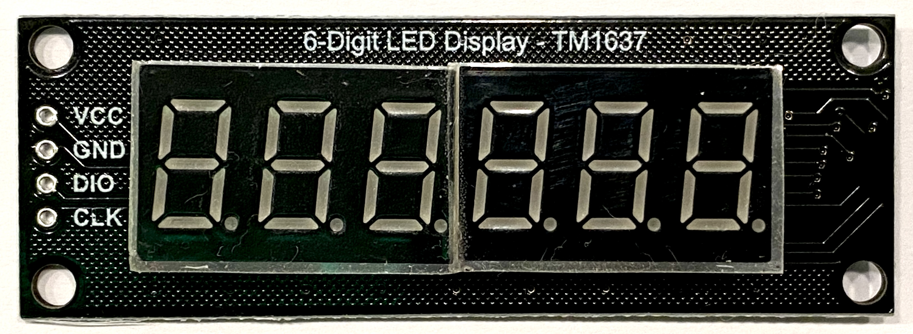

# ESP TM1637 #

ESP32 esp-idf Library for 7-segment LED Display modules with TM1637 chip on board

## Description

This library supports 4-digits and 6-digits modules with decimal points.
Not yet tested, but it should work with ESP8266_RTOS_SDK and under esp-open-rtos as well.





It takes care automatically for float numbers and displays positive or negative numbers with maximum possible signs after the decimal point.

The usage is simple as importing this raw in the main application:

```c
tm1637_print_float(Display, FloatValue);
```


Print string of characters based on ASCII code is possible by using the following example:

```c
tm1637_print_string(Display, "Auto");
```


Another useful function is for printing temperature values.

```c
tm1637_print_temp(Display, IntValue);
```
For example a temperature value multiplied by 10 (e.g. 242) is displayed as:


It also supports functions for testing segments, cleaning display, printing raw data etc.

## References and Credit

This library is based on:
*  https://www.mcielectronics.cl/website_MCI/static/documents/Datasheet_TM1637.pdf
*  https://github.com/petrows/esp-32-tm1637
*  https://github.com/jasonacox/TM1637TinyDisplay
*  https://github.com/avishorp/TM1637

You can find such modules at:
*  https://a.aliexpress.com/_vdwpwd
*  https://a.aliexpress.com/_v1qdS5
